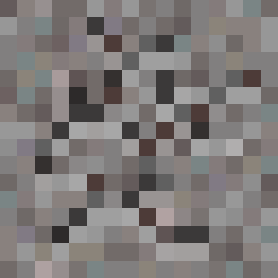
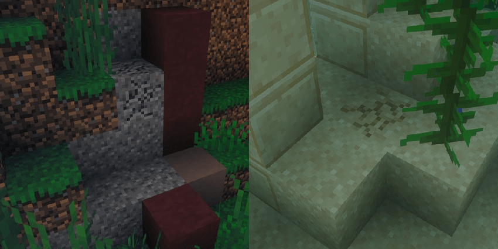
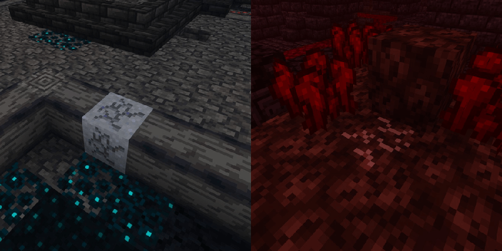

    
    <h1 align="center">Noticably Suspicious</h1>
    <h2 align="center">Makes suspicious blocks more noticable, but not too cheaty.</h2>

    
    

This resource pack makes **Suspicious blocks** easier to spot without being too obvious, unlike other packs that add frames, adjust colors, or make other dramatic changes. 

The textures use standard vanilla assets with the block-breaking overlay applied on top, slightly modified for visibility.

---

### **Supported Mods**
- [AllTheModium](https://www.curseforge.com/minecraft/mc-mods/allthemodium)

### **Affected Blocks**
- Suspicious Gravel
- Suspicious Sand

#### **AllTheModium**
- Suspicious Clay
- Suspicious Soul Sand

### **Screenshots**
 
 

### **License/Source**
This pack is licensed under the GNU General Public License v3.0.
Textures in this pack utilize assets from vanilla Minecraft, modified and distributed in accordance with the Minecraft EULA.

---

    <a class="human-made-floater" href="https://www.aimeecozza.com/human-made" title="100% Human Made Content">
        100% Human Made Content, No AI Used</b>">
    </a>

