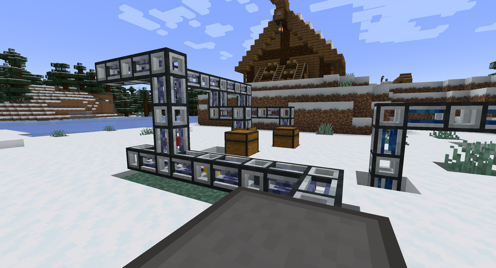

  
  <h1 align="center">Pretty Pretty Pipes</h1>
  <h2 align="center">Brings the 'Pretty Pipez' style to Pretty Pipes!</h2>

  
  

This resource pack brings the visual styling of the [_Pretty Pipez_](https://www.curseforge.com/minecraft/texture-packs/pretty-pipez) resource pack to the [_Pretty Pipes_](https://modrinth.com/mod/pretty-pipes) mod. The pack modifies pipe models and textures while maintaining item visibility within the pipes, but does **not** include connected texture/model support like the [_Pretty X Smart Pipez_](https://www.curseforge.com/minecraft/texture-packs/pretty-x-smart-pipez) resource packs.

Also check out [_Pretty Pretty Pipes: Mekanism_](https://modrinth.com/resourcepack/pretty-pretty-pipes-mekanism)!

---

### **Supported Mods**
- [Pretty Pipes](https://modrinth.com/mod/pretty-pipes)
- [Pretty Pipes: Fluids](https://modrinth.com/mod/pretty-pipes-fluids)

### **Screenshots**
 

### **License/Source**
This resource pack utilizes assets from the _Pretty Pipez_ pack in accordance with their GNUv3 license and is distributed under the same license.

---

  

