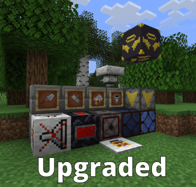

  
  <h1 align="center">Utilitarian Upgraded</h1>
  <h2 align="center">Refines the Utilitarian mod's texture to be closer in style with vanilla textures</h2>

  
  

This resource pack brings vanilla-style (JAPPA-fied) textures to the Utilitarian mod, replacing the original textures with designs that better match modern Minecraft's aesthetic.

---

### **Supported Mods**
- [Utilitarian](https://modrinth.com/mod/utilitarian)

### **Affected Block Textures**
- Angel Block
- Fluid Hopper
- Lapis Lamp
- Redstone Clock
- Soliciting Carpet
- Sound Muffler
- TPS Meter

### **Affected Item Textures**
- Fluid Hopper
- Restraining Order
- Trowel (Both States)

### **Screenshots**

### **License/Source**
This pack is licensed under the GNU General Public License v3.0.
Assets derived from vanilla are used under the Minecraft EULA.

---

  

