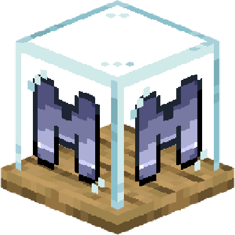
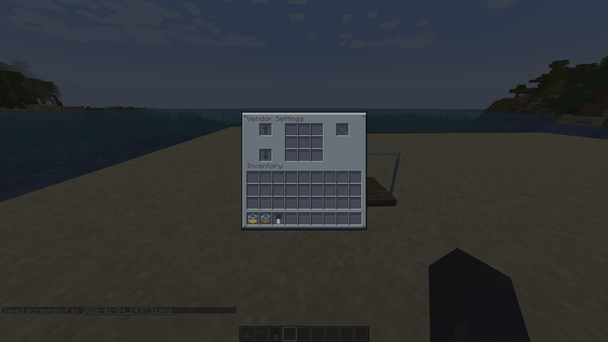
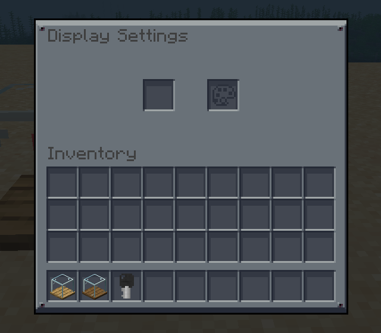
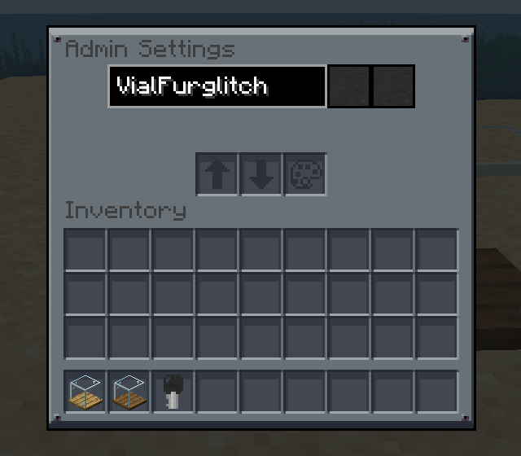

	
	<h1 align="center">Vending Block: Restocked - Mandala's GUI</h1>
	<h2 align="center">Mandala's GUI styling for my Vending Block: Restocked mod</h2>

	
	

This resource pack re-skins the GUI for the Vending Block: Restocked mod in the Mandala's GUI dark-mode aesthetic, adjusting container and slot artwork to match the theme.

---

### **Supported Mods**
- [Vending Block: Restocked](https://modrinth.com/mod/vending-block-restocked)

### **Screenshots**
 
 
 

### **License/Source**
This pack is licensed under the GNU General Public License v3.0.

---

	

